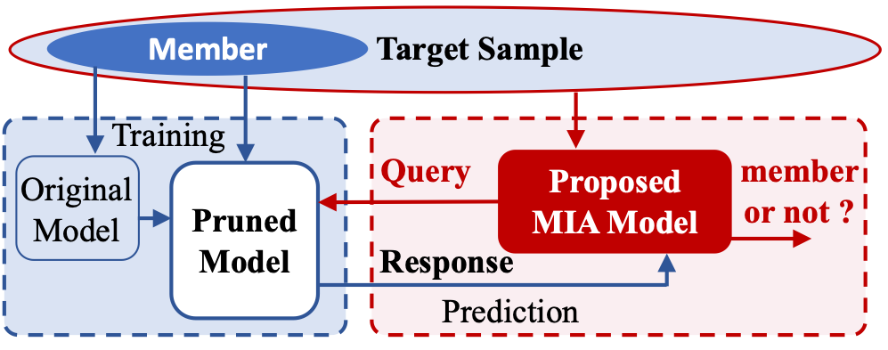

[comment]: <> (# mia_prune)
# Membership Inference Attacks and Defenses in Neural Network Pruning

This repository accompanies the paper [Membership Inference Attacks and Defenses in Neural Network Pruning](https://www.usenix.org/conference/usenixsecurity22/presentation/yuan-xiaoyong), 
accepted by USENIX Security 2022. The extended version can be found at [arXiv](https://arxiv.org/abs/2202.03335).
The repository contains the main code of membership inference attacks and defenses in neural network pruning. 
The code is tested on Python 3.8, Pytorch 1.8.1, and Ubuntu 18.04. 
GPUs are needed to accelerate neural network training and membership inference attacks.



# Background
Neural network pruning has been an essential technique to reduce the computation and memory requirements for using 
deep neural networks for resource-constrained devices.
We investigated the membership inference attacks (MIA) and the countermeasures in neural network pruning. 
We proposed a membership inference attack, namely self-attention membership inference attack (SAMIA), 
targeted at pruned neural networks, as well as a pair-based posterior balancing (PPB) defense method.

# Installation
Get the repository:
```
git clone https://github.com/Machine-Learning-Security-Lab/mia_prune
cd mia_prune
```
Install Python packages.
```
pip install -r requirements.txt
```
Create a folder for storing datasets. The data folder location can be updated in `datasets.py`.
```
mkdir -p data/datasets
```
Create a folder for storing the models.
```
mkdir results
```

# Usage

## Attacks
1. Train an original neural network:
```
python pretrain.py [GPU-ID] [config_path] 
```
2. Prune the model and fine-tune the model
```
python prune.py [GPU-ID] [config_path] --pruner_name [pruner_name] --prune_sparsity [prune_sparsity]
```
3. Conduct membership inference attacks on the pruned model.
```
python mia.py [GPU-ID] [config_path] --pruner_name [pruner_name] --prune_sparsity [prune_sparsity] --attacks [attacks]
```
4. Conduct membership inference attacks on the original model.
```
python mia.py [GPU-ID] [config_path] --attacks [attacks] --original
```

## Defenses
1. Based on an original model, prune the model and fine-tune the model with a defense method and its arguments.
```
python prune.py [GPU-ID] [config_path] --pruner_name [pruner_name] --prune_sparsity [prune_sparsity] 
--defend [defend] --defend_arg [defend_arg]
```
2. Conduct membership inference attacks on the pruned model with defense.
```
python mia.py [GPU-ID] [config_path] --pruner_name [pruner_name] --prune_sparsity [prune_sparsity] --attacks [attacks]
--defend [defend] --defend_arg [defend_arg]
```
3. Conduct membership inference attacks on the pruned model with defense when the attacker knows the defense (adaptive attack).
```
python mia.py [GPU-ID] [config_path] --pruner_name [pruner_name] --prune_sparsity [prune_sparsity] --attacks [attacks]
--defend [defend] --defend_arg [defend_arg] --adaptive
```

## Argument options
- `config_path` is the path of files in the `config` folder to get the information of the dataset and neural network architecture.
- `pruner_name` can be `l1unstructure` (default), `l1structure`, `l2structure`, `slim`.
- `prune_sparsity` can be any float values in (0, 1), default 0.7.
- `attacks` can be `samia` (default), `threshold`, `nn`, `nn_top3`, `nn_cls`. Multiple attacks can be concatenated. 
E.g., `--attacks samia,nn,nn_top3`. 
`threshold` attack (modified from https://github.com/inspire-group/membership-inference-evaluation) 
performs several threshold-based attacks including 
  - Ground-truth class confidence-based threshold attack (Conf).
  - Cross-entropy-based threshold attack (Xent).
  - Modified-entropy-based threshold attack (Mentr).
  - Top1 Confidence-based threshold attack (Top1-conf).
- `defend` can be `""` (basic defense, default), `ppb` (PPB defense), or `adv` (Adversarial Regularization). 
To run DP defense, please use `prune_dp.py`, where we use [pyvacy](https://github.com/ChrisWaites/pyvacy) to run 
DPSGD in fine-tuning. 

# Examples
Train a CIFAR10 model using ResNet18 model on GPU0.
```
python pretrain.py 0 config/cifar10_resnet18.json
```
Prune the model using l1unstructured pruning with sparsity level 70% (remove 70% parameters).
```
python prune.py 0 config/cifar10_resnet18.json --pruner_name l1unstructure --prune_sparsity 0.7
```
Attack the pruned model using SAMIA.
```
python mia.py 0 config/cifar10_resnet18.json --attacks samia
```
Attack the original model using SAMIA.
```
python mia.py 0 config/cifar10_resnet18.json --attacks samia --original
```
Prune the original model with PPB defense.
```
python prune.py 0 config/cifar10_resnet18.json --defend ppb --defend_arg 4
```
Attack the pruned model with defense using SAMIA.
```
python mia.py 0 config/cifar10_resnet18.json --attacks samia,threshold --defend ppb --defend_arg 4
```
Attack the pruned model with defense using SAMIA when the attacker knows the defense, e.g., adaptive attack.
```
python mia.py 0 config/cifar10_resnet18.json --attacks samia,threshold --defend ppb --defend_arg 4 ----adaptive
```
Launch multiple attacks.
```
python mia.py 0 config/cifar10_resnet18.json --attacks samia,nn,nn_top3
```

# Structure
- [pretrain.py](pretrain.py) is used to train the original neural network.
- [prune.py](prune.py) is used to prune and fine-tune the network with and without defenses.
- [mia.py](mia.py) is used to conduct attacks on the pruned/original network with and without defenses.
- [config](config) folder consists all the configuration files for various datasets and neural network architectures.
- [transformer.py](transformer.py) consists the self-attention model used in SAMIA attack.
- [base_model.py](base_model.py) includes the code for training, testing, and defense.


# Citation
```
@inproceedings{yuan2022membership,
  title = {Membership Inference Attacks and Defenses in Neural Network Pruning},
  booktitle = {31st USENIX Security Symposium (USENIX Security 22)},
  author={Yuan, Xiaoyong and Zhang, Lan},
  year={2022}
}
```
